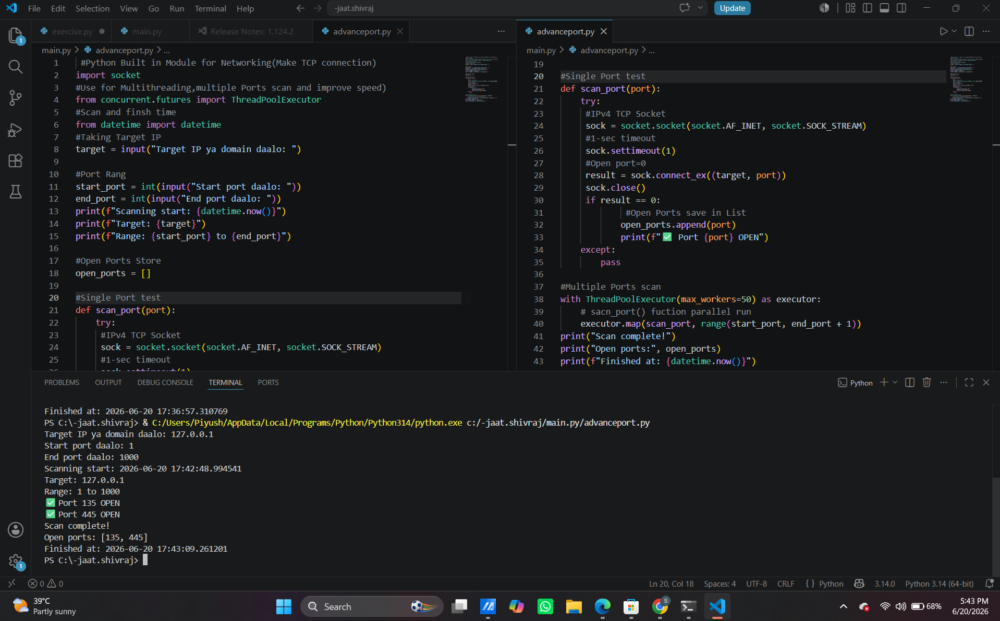

# 🚀 Advanced Multithreaded Port Scanner

A high-performance, asynchronous network security tool built in Python. This project utilizes multithreading to scan a range of target ports quickly and safely, helping security enthusiasts and network administrators identify open ports and potential system vulnerabilities.

---

## ✨ Features

* **⚡ High Performance:** Implements `ThreadPoolExecutor` with 50 concurrent threads for lightning-fast scanning.
* **🛡️ Smart Error Handling:** Uses `socket.connect_ex()` to gracefully handle connection statuses without throwing errors.
* **📊 Clean Output:** Displays results in a highly readable, structured terminal format.
* **💡 Ethical Safeguards:** Pre-configured with authorized testing environments (`scanme.nmap.org`).

---

## 🛠️ Architecture & Concepts Used

* **Socket Programming:** Direct network communication layer to test TCP connections.
* **Multithreading:** Concurrent programming to bypass sequential execution delays.
* **Exception Handling:** Robust management of user interruptions (`KeyboardInterrupt`) and hostname resolution failures (`gaierierror`).

---

## 🚀 How to Run the Project

### Prerequisites
Make sure you have **Python 3.x** installed on your system.

### Steps
1. Clone the repository to your local machine:
   ```bash
   git clone https://github.com
   ```
2. Navigate to the project directory:
   ```bash
   cd Advance-Port-Scanner
   ```
3. Run the scanner script (use quotes due to the file name space):
   ```bash
   python "Advance port scanner.py"
   ```

---

## 📸 Output / Screenshot

Here is the live execution output of the port scanner:



---

## 🗺️ Roadmap & Future Enhancements (v2.0)

As I progress through my Cybersecurity & Python journey, I plan to add the following features:
- [ ] **Banner Grabbing:** Detect the exact service/OS running behind the open port.
- [ ] **Export Options:** Save the scan results automatically to `.txt` or `.csv` files.
- [ ] **CLI Arguments:** Integrate `argparse` to allow user inputs directly from the terminal (e.g., `-t 192.168.1.1 -p 80-443`).

---

## ⚖️ Disclaimer

This tool is developed strictly for **educational purposes** and **ethical security testing**. Scanning networks or systems without explicit prior permission from the owner is illegal and unethical. The developer is not responsible for any misuse of this tool.

